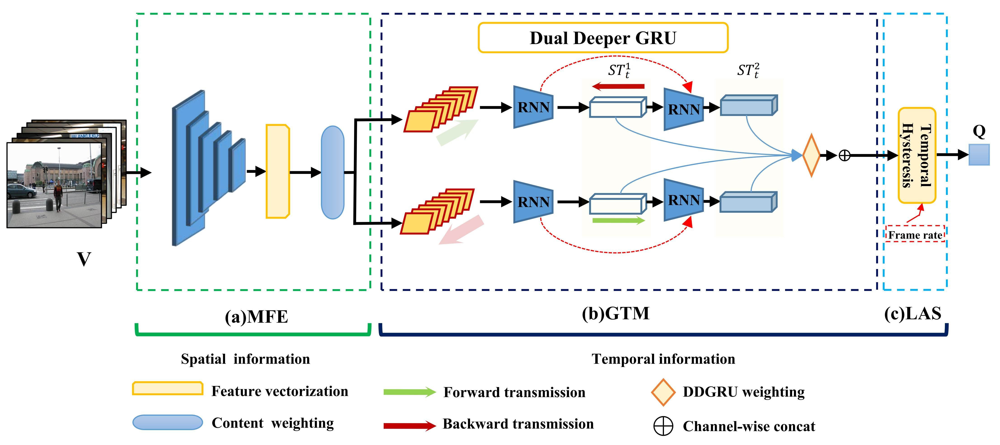

# Effificient Video Quality Assessment with Deeper Spatiotemporal Feature Extraction and Integration

the source code is coming soon before 2022.1.1.

## Description
DSTS-Net code for the following papers:

- Yinhao Liu, Xiaofei Zhou, Haibing Yin*,and so on. 
[Effificient Video Quality Assessment with Deeper Spatiotemporal Feature Extraction and Integration](https://dl.acm.org/citation.cfm?doid=3343031.3351028). Journal of Electronic imaging,SPIE,2021. 
[[paper]](...)

### Contact
Yinhao Liu, 15081620 AT hdu DOT edu DOT cn.
