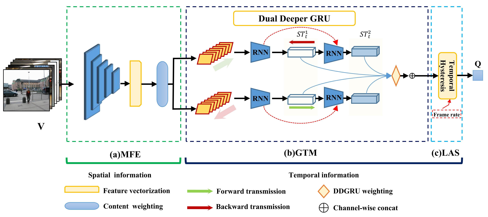
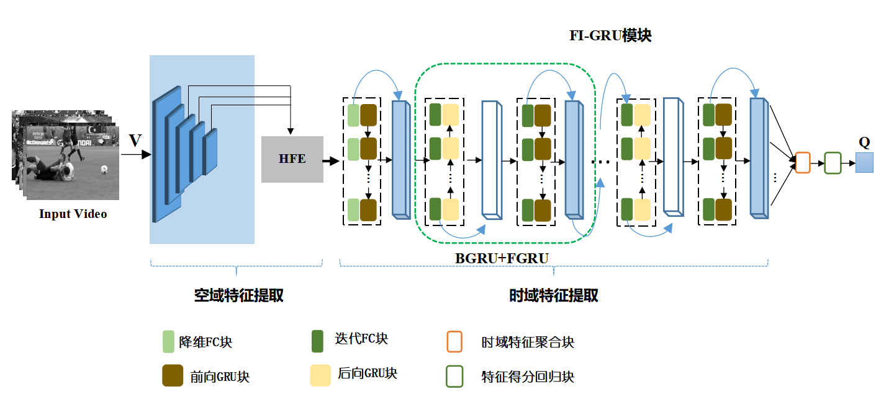

# Effificient Video Quality Assessment with Deeper Spatiotemporal Feature Extraction and Integration

the source code is coming soon before 2022.1.1.

## Description
DSTS-Net code for the following papers:

###English simplified version

Yinhao Liu, Xiaofei Zhou, Haibing Yin*,and so on. 

[Effificient Video Quality Assessment with Deeper Spatiotemporal Feature Extraction and Integration](https://www.spiedigitallibrary.org/journals/journal-of-electronic-imaging?SSO=1). Journal of Electronic imaging,SPIE,2021. 

###Chinese extend version
Yinhao Liu, Wei Zhang and so on.

[基于高阶深层时空信息的自媒体视频质量评价](https://kns.cnki.net/kcms/detail/detail.aspx?dbcode=CAPJ&dbname=CAPJLAST&filename=XXCN20211206003&uniplatform=NZKPT&v=FpR6QUdRBpz6GfWMvsKmkD-uiNgDS_BR_MljoVXmnnXC3Gc8WKAqHy30vkQRKFQY) 信号处理,2021.
 
  
###Performace
|DSTS-Net   | KoNViD-1k | CVD2014 | LIVE-Qualcomm | LIVE-VQC| 
|------| ----- | ----- | ----- | ----- 
|SROCC | 0.812| 0.881 | 0.790 | 0.758
|PLCC  | 0.817 | 0.876 | 0.799 | 0.778  
###How to use
SOC.py is used to extract second order covariance
DSTS_345_9ff_mean_fc.py is used to build deep temporal modeling network

## Contact
It's the first time for me to use the deep-learning and share it in github. 

So if you find some error, please feel free to contact me:

Yinhao Liu, 15081620@hdu.edu.cn.

## Acknowledgment
 Code and data prepration largely benefits from [VSFA](https://github.com/lidq92/SFA) by [Dingquan Li]().

